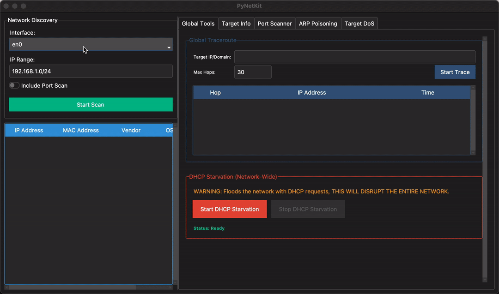

<div id="top">

<!-- HEADER STYLE: CONSOLE -->
<div align="center">

```console
██████╗ ██╗   ██╗███╗   ██╗███████╗████████╗██╗  ██╗██╗████████╗
██╔══██╗╚██╗ ██╔╝████╗  ██║██╔════╝╚══██╔══╝██║ ██╔╝██║╚══██╔══╝
██████╔╝ ╚████╔╝ ██╔██╗ ██║█████╗     ██║   █████╔╝ ██║   ██║   
██╔═══╝   ╚██╔╝  ██║╚██╗██║██╔══╝     ██║   ██╔═██╗ ██║   ██║   
██║        ██║   ██║ ╚████║███████╗   ██║   ██║  ██╗██║   ██║   
╚═╝        ╚═╝   ╚═╝  ╚═══╝╚══════╝   ╚═╝   ╚═╝  ╚═╝╚═╝   ╚═╝   
```

*A dual-interface network mapper and security auditing toolkit.*

</div>


---

> 🚨
> **Legal Disclaimer**
>
> PyNetKit is intended strictly for **educational purposes** and **authorized network auditing** on networks you own or have explicit written permission to test. Running any of these tools against networks or systems without mutual consent is **illegal** and may violate the Computer Fraud and Abuse Act (CFAA), the Computer Misuse Act, or equivalent laws in your jurisdiction. **The author assumes no liability** for any misuse, damage, or legal consequences arising from the use of this software. Use responsibly.

---

<br>

## ⚛️ Table of Contents

<details>
<summary>Table of Contents</summary>

- [⚛️ Table of Contents](#️-table-of-contents)
- [🔮 Overview](#-overview)
- [💫 Features](#-features)
- [⚡ Getting Started](#-getting-started)
    - [💠 Prerequisites](#-prerequisites)
    - [🔷 Installation](#-installation)
    - [🔹 Usage](#-usage)
    - [🔸 Testing](#-testing)
- [🤖 AI Transparency](#-ai-transparency)
- [⭐ License](#-license)

</details>

---

## 🔮 Overview

PyNetKit is a network discovery and security auditing toolkit with a **dual interface**: a terminal-first CLI powered by [Rich](https://github.com/Textualize/rich) and a full graphical GUI built with [ttkbootstrap](https://ttkbootstrap.readthedocs.io/). Both surfaces expose the same feature set, so you can choose the workflow that fits the task.

All packet-level operations - ARP requests, TCP SYN scans, UDP probes, ICMP traceroute, and Layer 2 attack frames - are handled by [Scapy](https://scapy.net/), giving PyNetKit precise, low-level control over the network stack without relying on external system tools like `nmap` or `traceroute`.

The toolkit is structured around three concerns: **discovery** (find hosts and open ports on a local subnet), **intelligence** (fingerprint OS families, trace network paths, log DNS activity), and **auditing** (ARP poisoning MiTM, ARP-based DoS blackholing, DHCP starvation).

<br>
<div align="center">

**GUI - Host Discovery and Commands**
> *Scanning a subnet, inspecting discovered hosts, showcasing Global Tools, and navigating the per-host attack tabs (Target Info, Port Scanner, ARP Poisoning, DoS).*



</div>

---

## 💫 Features

**Network Discovery**
- ARP broadcast scanning across any local subnet - single IP or CIDR range.
- Resolves both IP and MAC address for every responding host.

**Port Scanning**
- **TCP SYN scan** - classifies ports as `open` (SYN-ACK), `closed` (RST-ACK), or `filtered` (no response).
- **UDP scan** - probes UDP ports and uses ICMP unreachable replies to determine state; unanswered probes are reported as `open|filtered`.
- **Service identification** - maps common port numbers (22, 80, 443, 3306, 3389, etc.) to well-known service names.
- **OS fingerprinting** - infers broad OS family (Linux/Unix, Windows, Cisco/Network Device) from the TTL value in responses.

**Traceroute**
- ICMP-based path tracing with configurable maximum hops and per-hop round-trip time measurement.
- Accepts hostnames in addition to IPs; resolves names via a direct Scapy DNS query to `8.8.8.8`.

**ARP Poisoning (Man-in-the-Middle)**
- Simultaneously poisons both the target and the gateway to intercept bidirectional traffic.
- Forwards all captured packets in real time so the target's connection remains live.
- **PCAP capture** - optionally writes intercepted traffic to a timestamped `.pcap` file organized under `hosts/<target_ip>/captures/`.
- **DNS spoofing** - intercepts DNS queries for a specified domain and returns a custom IP, enabling silent traffic redirection.
- Tracks and persists all domains queried by the target during the session to `hosts/<target_ip>/visited_domains.txt`.
- Restores both ARP tables cleanly on stop, whether exited normally or via `Ctrl+C`.

**Denial of Service**
- **Single-target blackhole** - poisons the target and gateway with two distinct dummy MACs, dropping all inbound and outbound traffic for the chosen host without forwarding anything. Sets a static ARP entry on the attacker's own machine to prevent self-poisoning.
- **DHCP starvation** - floods the network with DHCP Discover packets using randomized source MACs and transaction IDs, exhausting the DHCP address pool for all devices on the segment.

**Dual Interface**
- **CLI** - Rich-formatted panels, tables, and progress indicators. Full `argparse` subcommand structure (`scan`, `arp`, `dos single`, `dos network`, `trace`) with input validation and helpful error output.
- **GUI** - ttkbootstrap dark-mode window. Split-pane layout: host discovery table on the left, tabbed detail view (Port Scanner, ARP Poisoning, DoS, Traceroute) on the right. All network operations run in background threads to keep the UI responsive.

---


## ⚡ Getting Started

### 💠 Prerequisites

- **Python** >= 3.8
- **pip**

> [!WARNING]
> **Windows: Npcap is required**
>
> Scapy requires Npcap for Layer 2 packet capture and injection on Windows. Without it, every feature in PyNetKit - scanning, attacks, and traceroute - will fail silently or error on startup.
>
> 1. Download the Npcap installer from **[npcap.com/#download](https://npcap.com/#download)**
> 2. During installation, **check "Install Npcap in WinPcap API-compatible Mode"**
> 3. Reboot if prompted, then proceed with the installation steps below.

### 🔷 Installation

1. **Clone the repository:**

    ```sh
    git clone https://github.com/OhadBragin/pynetkit
    ```

2. **Navigate to the project directory:**

    ```sh
    cd pynetkit
    ```

3. **Install the package and its dependencies:**

	**Using [pip](https://pypi.org/project/pip/):**

    ```sh
    python -m venv venv  # Optional, but recommended
    source venv/bin/activate  #Windows: venv\Scripts\activate
    pip install .
    ```

### 🔹 Usage

All features require elevated privileges - run with `sudo` on Linux/macOS, or from an **Administrator** terminal on Windows.

**Launch the GUI:**

```sh
# Linux / macOS
sudo pynetkit -g

# Windows (Administrator terminal)
pynetkit -g
```

---

#### 🔍 Scanning & Traceroute

<div align="center">

**CLI - Subnet Scan with Port Detection**
> *ARP host discovery across a /24 with MAC vendor detection, followed by TCP SYN and UDP port scanning with service names and OS fingerprinting.*


</div>

<details>
<summary>📖 scan &amp; trace — commands, flags, and examples</summary>

<br>

> **Note:** Replace `eth0` with the appropriate interface name for your system. Use `ip link` (Linux) or `ipconfig` (Windows) to list available interfaces.

---

##### `scan` — Host Discovery & Port Scanning

Performs ARP broadcast scanning to find live hosts on a subnet. Optionally runs TCP SYN and UDP port scans on each discovered host, with service identification and OS fingerprinting.

```sh
sudo pynetkit scan <target> [options]
```

| Argument | Type | Description |
|----------|------|-------------|
| `target` | positional | IPv4 address or CIDR range to scan (e.g. `192.168.1.1` or `192.168.1.0/24`). |
| `-i` / `--iface` | flag | Network interface to use (e.g. `eth0`). Manual selection is strongly recommended. |
| `-p` / `--port` | switch | Enable port scanning on discovered hosts. |
| `-r` / `--range` | value | Port range to scan. Accepts a single port (`80`) or a range (`1-1024`). Defaults to `1-1024`. Only used when `-p` is set. |

```sh
# ARP host discovery only
sudo pynetkit scan 192.168.1.0/24 -i eth0

# Host discovery + port scan (default range 1-1024)
sudo pynetkit scan 192.168.1.0/24 -i eth0 -p

# Host discovery + port scan on a custom range
sudo pynetkit scan 192.168.1.0/24 -i eth0 -p -r 1-65535

# Scan a single host on a specific port
sudo pynetkit scan 192.168.1.50 -i eth0 -p -r 443
```

---

##### `trace` — Traceroute

ICMP-based path tracing with per-hop round-trip time measurement. Accepts both IP addresses and hostnames (resolved via Scapy DNS query to `8.8.8.8`).

```sh
sudo pynetkit trace <target> [options]
```

| Argument | Type | Description |
|----------|------|-------------|
| `target` | positional | Target IP address or hostname (e.g. `google.com` or `8.8.8.8`). |
| `-m` / `--max-hops` | value | Maximum number of hops before giving up. Defaults to `30`. |

```sh
# Traceroute to a domain
sudo pynetkit trace google.com

# Traceroute to an IP with a custom hop limit
sudo pynetkit trace 8.8.8.8 -m 20
```

</details>

---

#### ⚔️ ARP Poisoning & DoS

<div align="center">

**CLI - ARP Poisoning**
> *Resolving target and gateway MACs, launching a bidirectional MiTM attack, and cleanly restoring ARP tables on stop.*


</div>

<details>
<summary>📖 arp &amp; dos — commands, flags, and examples</summary>

<br>

> **Note:** Replace `eth0` with the appropriate interface name for your system. Use `ip link` (Linux) or `ipconfig` (Windows) to list available interfaces.

---

##### `arp` — ARP Poisoning (Man-in-the-Middle)

Simultaneously poisons the target and the gateway to intercept bidirectional traffic. Optionally captures traffic to a `.pcap` file and/or performs DNS spoofing for a specified domain. ARP tables are restored cleanly on exit.

```sh
sudo pynetkit arp <target> [options]
```

| Argument | Type | Description |
|----------|------|-------------|
| `target` | positional | Victim IP address (e.g. `192.168.1.50`). |
| `-i` / `--iface` | flag | Network interface to use (e.g. `eth0`). Manual selection is strongly recommended. |
| `-s` / `--save` | switch | Save all intercepted packets to a timestamped `.pcap` file under `hosts/<target_ip>/captures/`. |
| `--dns-domain` | value | Domain name to spoof (e.g. `google.com`). Must be paired with `--dns-ip`. |
| `--dns-ip` | value | IP address to return for the spoofed domain. Must be paired with `--dns-domain`. |

> `--dns-domain` and `--dns-ip` must always be provided together — one without the other is an error.
> Visited domains are automatically logged to `hosts/<target_ip>/visited_domains.txt` for every session.

```sh
# Basic MiTM attack
sudo pynetkit arp 192.168.1.50 -i eth0

# MiTM with PCAP capture
sudo pynetkit arp 192.168.1.50 -i eth0 -s

# MiTM with DNS spoofing
sudo pynetkit arp 192.168.1.50 -i eth0 --dns-domain example.com --dns-ip 10.0.0.1

# Full combo: MiTM + DNS spoofing + PCAP capture
sudo pynetkit arp 192.168.1.50 -i eth0 --dns-domain example.com --dns-ip 10.0.0.1 -s
```

---

##### `dos single` — ARP Blackhole (single target)

Poisons the target and gateway with two distinct dummy MACs, dropping all inbound and outbound traffic for the target without forwarding anything. Sets a static ARP entry on the attacker's machine to prevent self-poisoning.

```sh
sudo pynetkit dos single <target> [options]
```

| Argument | Type | Description |
|----------|------|-------------|
| `target` | positional | Target IP address (e.g. `192.168.1.50`). |
| `-i` / `--iface` | flag | Network interface to use (e.g. `eth0`). |

```sh
sudo pynetkit dos single 192.168.1.50 -i eth0
```

---

##### `dos network` — DHCP Starvation (entire network)

Floods the network with DHCP Discover packets using randomized source MACs and transaction IDs, exhausting the DHCP address pool for all devices on the segment.

```sh
sudo pynetkit dos network [options]
```

| Argument | Type | Description |
|----------|------|-------------|
| `-i` / `--iface` | flag | Network interface to use (e.g. `eth0`). |

```sh
sudo pynetkit dos network -i eth0
```

</details>

---

For quick inline help, every subcommand supports `--help`:

```sh
pynetkit --help
pynetkit scan --help
pynetkit arp --help
pynetkit dos --help
pynetkit trace --help
```

### 🔸 Testing

PyNetKit uses the [pytest](https://docs.pytest.org/) test framework. Run the full test suite with:

**Using [pip](https://pypi.org/project/pip/):**
```sh
pytest
```

---

## 🤖 AI Transparency

Most of this tool's frontend(GUI, CLI Printing, README...) was created using AI. All generated output was reviewed, modified where necessary, and assembled by the author. Architecture decisions, feature design, and the entire backend are my own work.

---

## ⭐ License

PyNetKit is licensed under the [MIT License](LICENSE). For more details, refer to the [LICENSE](LICENSE) file.

---

<div align="right">

[![][back-to-top]](#top)
---
**Author:** Ohad Bragin | [GitHub](https://github.com/OhadBragin)
</div>

[back-to-top]: https://img.shields.io/badge/-BACK_TO_TOP-151515?style=flat-square
